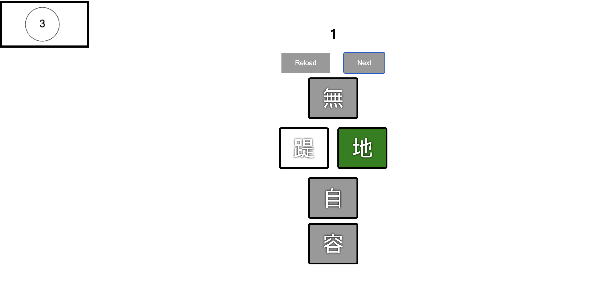

# Senkin (千金)

This is the repository for the **Senkin (千金)** project. It's a JavaScript-based game that challenges players to select the correct Chinese word from multiple options within a time limit. The game aims to improve vocabulary and language recognition skills in Chinese while providing an enjoyable gaming experience.

## Technologies Used

- HTML
- CSS
- JavaScript

## Getting Started

To run the game locally, follow these steps:

1. Clone the repository: `git clone https://github.com/pocession/senkin`
2. Navigate to the project directory: `cd senkin`
3. Open the `index.html` file in a web browser.

## How to Play

1. When the game starts, you will see a set of word options displayed on the screen.
2. Select the correct word that matches the given prompt.
3. Click the "Next" button to proceed to the next question.
4. The game will keep track of your score, displayed at the top of the screen.
5. The timer at the bottom of the screen indicates the remaining time for each question.
6. Once the time is up, the game will display the correct answer and update your score.
7. Continue playing and try to achieve the highest score possible!

## Additional Features

- The game dynamically generates random word combinations for each question.
- The selected word is highlighted in different colors to indicate correctness.
- The game includes a countdown timer to create a sense of urgency.

## License

This project is licensed under the [MIT License](LICENSE).

## Acknowledgments

Special thanks to [公視](https://www.pts.org.tw/2021wonderful_word/) for inspiration for this project.

## Screenshots

  
   
  

